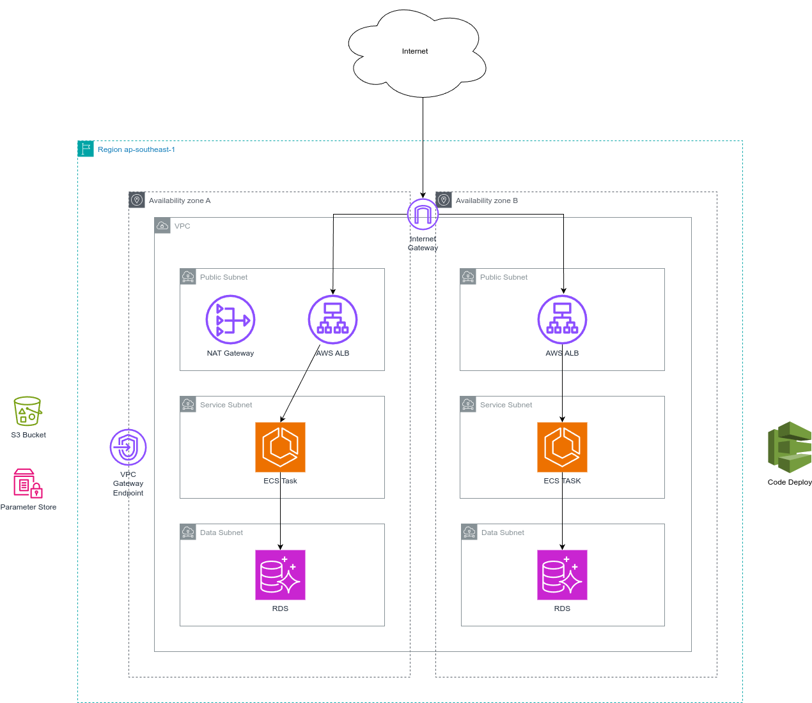

# AWS Architecture Spec

The spec of AWS architecture provisioned by the Terraform codes written in this repo will be explained in this docs.

## VPC

The `Infra-Foundation` Terraform code generates a VPC in Singapore region with two availability zones. Each availability zone will have three subnets each, which are the `public subnet`, `service subnet`, and `data subnet`.
- The public subnet has routes to the entire VPC and the internet gateway. So, every resources deployed on this subnet should be able to access the internet. AWS NAT Gateway or NAT Instance and public AWS Application Load Balancer are deployed on this subnet.
- The service subnet has route to the entire VPC. Since it has no direct access to the internet gateway, it has specific default route to AWS NAT Gateway or NAT Instance, so it could still access the internet. Services will be deployed on this subnet.
- The data subnet only has route to the entire VPC, but no default route to the NAT Gateway. So, every instances deployed here are unable to reach the internet. Storage services such as database are suitable to be deployed in this subnet.

In every subnets, there is a special route to a VPC Gateway Endpoint of S3 Bucket. So, every requests coming from our VPC to the S3 bucket won't be charged with AWS Data Transfer cost.

To access the internet, the used Terraform module provides choice between using `AWS NAT Gateway` or `NAT Instance` deployed using [fck-nat](https://fck-nat.dev/v1.3.0/) and AWS EC2. The NAT Gateway is the recommended way to provide access to the internet since its availability and scale is guaranteed by AWS, so it should be the chosen approach in production. In non-production environment, it is okay to use the NAT Instance to press the cost. The module provides the option to deploy AWS NAT Gateway in multiple availability zones, but in this project only one availability zone is deployed with NAT Gateway to press the cost.

## Service Deployed Using ECS

The simple-webserver service is deployed using ECS Fargate which the creation of the ECS Service and Task Definition is done using Terraform. The webserver service is currently deployed with only one replica of ECS task and it has two containers, the webserver service itself which is basically an NGINX and an init sidecar container used to fetch HTML file from the S3 bucket. The `html-fetcher` container knows which path of the S3 bucket containing the HTML file that it should pull from an environment variable with value from AWS SSM Parameter Store. These paths provided in both the S3 bucket and SSM parameter are dynamic using commit SHA since they are generated by GitHub Actions Workflow. The container logs are pushed to AWS CloudWatch, so it could be monitored from AWS Console.

There is an AWS Application Load Balancer in front of the ECS service, so the service is accessible from the internet and the requests will be distributed between the replicas.

The deployment of the service is controlled by AWS Code Deploy using all-in Blue Green deployment. Upon triggered, Code Deploy will handle the deployment of the new version of the ECS task and its registration with the `blue` AWS ALB target group. When the deployment is done, Code Deploy changes the target group of the AWS ALB to the `blue` target group which target the new version of the task, basically directly reroute 100% traffic to the new version. After one minute of of waiting, the old version of the task will be decommissioned and the deployment is finished. In the case of failure, Code Deploy will trigger rollback automatically.
